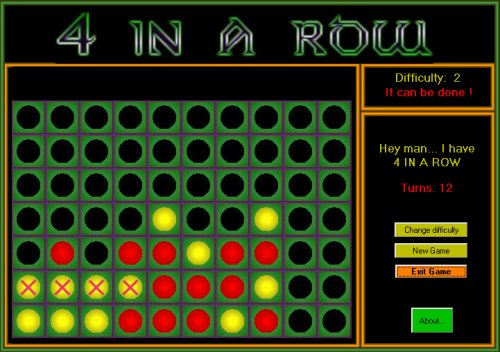



## Four\-In\-A\-Row

### Description

A very popular game last century here in Europe, So I coded this with VB. You play against the computer. Difficulty is from 'soft' to 'very hard'. See screenshot. It did take a lot of math to calculate all different steps the computer has to take, but it works fine.
 
### More Info
 

             |
---                |---
**Submitted On**   |2000-05-25 09:10:22
**By**             |[stephane swertvaegher](https://github.com/Planet-Source-Code/PSCIndex/blob/master/ByAuthor/stephane-swertvaegher.md)
**Level**          |Intermediate
**User Rating**    |5.0 (20 globes from 4 users)
**Compatibility**  |VB 6\.0
**Category**       |[Games](https://github.com/Planet-Source-Code/PSCIndex/blob/master/ByCategory/games__1-38.md)
**World**          |[Visual Basic](https://github.com/Planet-Source-Code/PSCIndex/blob/master/ByWorld/visual-basic.md)
**Archive File**   |[Four\-In\-A\-54269292002\.zip](https://github.com/Planet-Source-Code/stephane-swertvaegher-four-in-a-row__1-31647/archive/master.zip)

